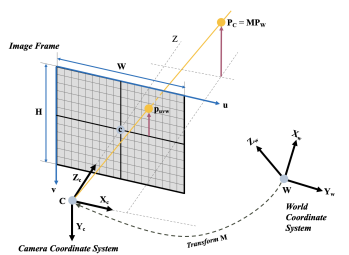
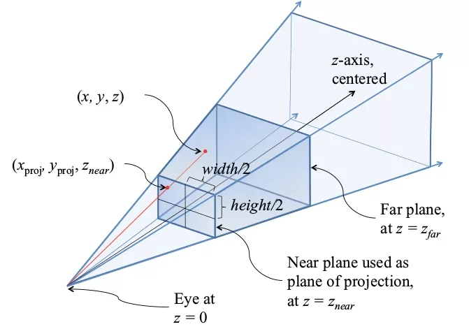

# Vision6D Image Mesh Plane Description

  
  

This is **faking a pinhole camera in 3D space** so that **moving a mesh in 3D produces the same pixel motion as a real camera**, without doing real projection math.

---

## The real pinhole equation (ground truth)

In a real camera:

$$
y_{\text{pixel}} = f_y \cdot \frac{Y}{Z}
$$

So:

* move object up in 3D (`Y ↑`) → pixel moves up
* move object farther (`Z ↑`) → pixel motion shrinks
* `f_y` controls the scale

---

## What Vision6D tool does instead 

Instead of computing that equation explicitly, you:

1. **Put the image plane in 3D**
2. **Place it at**

$$
   Z = f_y
$$

3. Render everything with a normal 3D camera

Now, when a mesh point moves by `Y` at depth `Z`, perspective rendering naturally produces:

$$
\text{screen offset} \approx \frac{f_y \cdot Y}{Z}
$$

---

## Why this works visually

Because perspective rendering already does:

$$
(x, y) \sim \frac{1}{Z}
$$

So by choosing:

$$
\text{image plane depth} = f_y
$$

you bake the focal length directly into the geometry.

No manual projection needed.

---

## Why this is NOT a physical camera

This setup:

* ❌ ignores sensor size
* ❌ ignores near/far planes
* ❌ ignores lens properties
* ❌ ignores metric units

It only preserves **relative alignment**, which is exactly what labeling tools need.

---

## Why annotation tools love this trick

Because it gives you:

* correct **parallax**
* correct **depth scaling**
* intuitive **drag-to-align**
* zero matrix math per frame

All while “feeling” like a camera.

---

## Conclusion

> Setting the image plane at `Z = fy` turns 3D perspective rendering into a visual implementation of the pinhole projection equation — perfect for alignment, not for physics.
